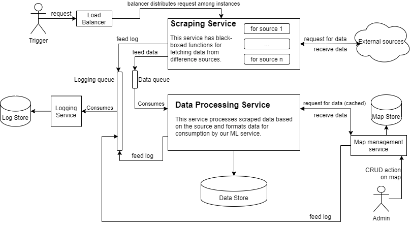

# Elastic Scraper
A 'stretchable' scraper, that can source data from heterogenous sources and standardize for ML pipelines.

## Requirements

- must support heterogenous feedback sources (Intercom, Play Store, Twitter, Discourse etc)
- push and pull integration model
- Multi-tenancy
- metadata ingestion — each source has different metadata
- transformation to an internal structure, which should
    - support different types of feedback
    - support source specific metadata
    - have common record level attributes (language, source, info etc.)

## Bonus Requirements

- Idempotency
- Multiple feedback sources from same platform, eg. from two Play Store apps for the same user

## Assumptions
- Assuming a black box function to scrape each source and return response data.

## Initial Thoughts
- identify common attributes among the different sources of feedback, first principles approach on what constitutes a feedback
- identification of functionalities :
    1. scraping from source
        - different sources would need different handling, should be scalable to new sources
        - need to think about source specification and handlers
    2. metadata processing
    3. breakdown into common record level attributes and source specific attributes
    4. pushing processed data to store
        - database should be scalable to new sources, channel agnostic
        - fetching should be optimized for retrieval

## System Design

Taking a microservice based approach to ensure scalability and failure tolerance. Multi-instance deployments can also provide multi-tenancy, which is a key requirement. The components I planned:

- a scraper micro-service which has source-specific black box functions available for scraping
- a load balancer to balance scraping requests between different instances our scraper service
- a data processing service to consume scraped data, convert it into storable formats, and store it to DB
- a logging service to store logs from different services
- a map management service/tool
- a queuing service with the following queues:
    - scraped data queue : fed by scraper service, consumed by data processing service
    - logging queue : fed by scraper service and processing service, consumed by logging service
- a data store, written to by data processing service
- a log store, written to by the logging service
- a map store, read by data processing service, written to and read by map management service

## Control Flow
- a trigger sends a request to scrape content 
- the load balancer receives this content and distributes the request to a free instance of the scraper service
- the scraper service processes the requests, chunks messages, and sends them to the data queue
- the scraper service also queues info and error logs to the log queue
- multiple instances of the data processing service constantly poll the data queue
- when a message arrives in the data queue, it is consumed by a free instance of the data processing service
- the data processing requests the map management service to send the request specific map
- the map management service looks up the specific map for the source and returns it
- this map is cached at the data processing service level 
- the consumed data is processed and converted into standardized feedback and metadata formats
- the converted data is pushed to the data store
- throughout this process, logs are queued to the logging queue
- the logging service constantly polls for logs and stores them / pushes them to a monitoring tool

## Deployment Approach

## Future Extensions

## Drawbacks